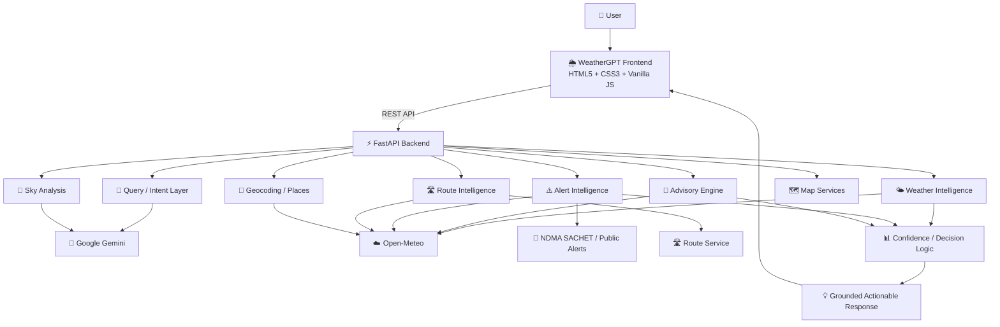

[README .md](https://github.com/user-attachments/files/32769399/README.md)
<div align="center">

# 🌦️ WeatherGPT

### Conversational Weather Intelligence for India

**Ask the weather. Understand the risk. Decide what to do.**

[](https://www.sih.gov.in/)
[](https://www.python.org/)
[](https://fastapi.tiangolo.com/)
[](https://developer.mozilla.org/en-US/docs/Web/JavaScript)
[](https://open-meteo.com/)
[](https://ai.google.dev/)

**Smart India Hackathon 2026 · Problem Statement 26068**  
*WeatherGPT: Conversational AI for Weather Forecasting, Alerts, and Climate Information*

**Ministry of Earth Sciences · India Meteorological Department · Disaster Management**

[📖 Problem Statement](#-sih-problem-statement) · [🚀 Features](#-key-capabilities) · [🏗️ Architecture](#️-system-architecture) · [⚙️ Setup](#️-getting-started) · [🧪 API](#-api-surface) · [🗺️ Roadmap](#️-roadmap)

</div>

---

## 🌍 What is WeatherGPT?

Weather information is abundant, but **actionable weather intelligence is fragmented**.

Users are often forced to move between forecasts, maps, warning portals, air-quality dashboards, satellite products, and bulletins just to answer a simple question:

> **“What does the weather mean for me?”**

**WeatherGPT** is a conversational weather-intelligence platform that sits between complex meteorological data and everyday decision-making.

Instead of returning only:

```text
Temperature: 29°C
Rain probability: 70%
Wind: 18 km/h
```

WeatherGPT aims to answer:

```text
Rain risk is higher around your commute window.
Leaving earlier gives you a more suitable weather window.
The main concern is precipitation rather than temperature.
```

The platform combines **live meteorological data, AI-powered natural-language understanding, deterministic weather analysis, location intelligence, route weather, contextual advisories, alerts, maps, voice interaction, and explainable recommendations** in one interface.

> ### Core idea
> **Weather apps show weather. WeatherGPT turns weather into decisions.**

---

# 🎯 SIH Problem Statement

## Problem Statement 26068

### **WeatherGPT: Conversational AI for Weather Forecasting, Alerts, and Climate Information**

**Organization:** Ministry of Earth Sciences (MoES)  
**Department:** India Meteorological Department (IMD)  
**Category:** Software  
**Theme:** Disaster Management

### The challenge

Weather information is distributed across multiple portals, bulletins, satellite products, forecast systems, and warning platforms. This makes it difficult for citizens, researchers, disaster managers, and government agencies to quickly obtain **contextual and actionable information**.

The problem statement calls for an AI-powered conversational platform capable of:

- Real-time weather information retrieval
- Natural-language weather queries
- Integration with numerical weather prediction data
- Extreme-weather alerts and early-warning dissemination
- Location-based forecasts and advisory generation
- Multilingual support for Indian languages
- Climate and historical-weather analysis
- Voice-enabled interaction for accessibility
- Decision support for agriculture, aviation, marine, urban and public use cases

### Our interpretation of the problem

WeatherGPT treats the conversational interface as the **intelligence layer** connecting users with meteorological data.

```text
                    METEOROLOGICAL DATA
                            │
                            ▼
┌───────────────┐   ┌──────────────────┐   ┌─────────────────┐
│ Forecast Data │   │ Alerts / Warnings│   │ Location / Map  │
└───────┬───────┘   └─────────┬────────┘   └────────┬────────┘
        │                      │                     │
        └──────────────────────┼─────────────────────┘
                               ▼
                    ┌─────────────────────┐
                    │     WeatherGPT      │
                    │ Intelligence Layer  │
                    └──────────┬──────────┘
                               ▼
                 ┌──────────────────────────┐
                 │ Natural-language answer │
                 │ + context + reasoning   │
                 │ + advisory + confidence │
                 └────────────┬─────────────┘
                              ▼
                         👤 THE USER
```

---

# 💡 Why WeatherGPT?

Most weather interfaces are optimized for **data consumption**.

WeatherGPT is optimized for **decision support**.

| Traditional weather experience | WeatherGPT approach |
|---|---|
| “What is the temperature?” | “Is this comfortable for my activity?” |
| “Will it rain?” | “When is the safest/better window?” |
| “Weather at destination” | “What will the weather be along my route?” |
| “Alert map” | “Which alerts matter near me?” |
| “Forecast numbers” | “What do these numbers mean?” |
| “Generic forecast” | “Advice based on activity/persona” |
| “Static dashboard” | “Conversational exploration” |
| “One confidence level” | “Confidence-aware interpretation” |

The result is a **weather decision-support layer**, not simply another forecast UI.

---

# 🚀 Key Capabilities

## 01 · 🧠 Activity-Aware Weather Intelligence

WeatherGPT considers **what the user is trying to do**, not just where they are.

Supported activity-oriented use cases include:

- Walking
- Running / fitness
- Commuting
- Travelling
- Photography
- Laundry
- Farming-oriented advisory scenarios
- Fishing-oriented advisory scenarios
- Outdoor activities

The same weather conditions can produce different recommendations depending on the activity.

**Mechanism:** `Activity / intent → relevant weather variables → activity scoring → recommendation`

---

## 02 · 🎯 Perfect Weather Window Finder

Instead of asking users to scan 24 hourly forecast cards, WeatherGPT can evaluate forecast periods and identify **more suitable windows** for an activity.

The scoring layer can consider:

- Precipitation
- Probability of precipitation
- Temperature
- Apparent temperature
- Wind / gusts
- Visibility
- Weather condition
- Activity-specific thresholds

### Example

> **User:** “When should I go for a run today?”
>
> **WeatherGPT:** “A later window has lower heat and lower rain risk. Wind conditions are also more manageable.”

The important shift is from **forecast retrieval** to **forecast interpretation**.

---

## 03 · 🛣️ Weather-Aware Route Intelligence

A destination forecast does not tell the complete story of a journey.

WeatherGPT can evaluate weather conditions along a route instead of looking only at the starting or ending point.

```text
START
  │
  ▼
📍 Point A ─── 🌧️ ─── 📍 Point B ─── 🌬️ ─── 📍 Point C
                         │
                         ▼
                 Weather conditions
                 sampled along route
                         │
                         ▼
                 Journey-level insight
```

Relevant factors can include:

- Rain exposure
- Wind
- Visibility
- Weather deterioration
- Forecast conditions at sampled route points

This makes route weather useful for **commuters, travellers, riders, delivery users and outdoor journeys**.

---

## 04 · ⚠️ Contextual Weather Alerts

WeatherGPT contains an alert engine capable of deriving weather-related risks from available forecast conditions and incorporating public warning information where available.

Alert categories include conditions such as:

- Heavy rain
- Heat
- Wind
- Storm / thunderstorm conditions
- Fog
- Cold conditions
- Air-quality risk

The system can combine:

```text
Forecast conditions
       +
Official/public warning information
       ↓
Alert intelligence
       ↓
Severity + location relevance
       ↓
User-facing explanation
```

> **Important:** forecast-derived alerts are not presented as substitutes for official government warnings. Source type and limitations matter.

---

## 05 · 🇮🇳 India-Wide Alert Intelligence

WeatherGPT includes an interactive India-wide alert view that helps users move beyond a single-location forecast.

It supports:

- India-wide alert retrieval
- Severity-aware presentation
- Location-aware prioritisation
- Distance-aware ranking
- Interactive map markers
- Near-user alert discovery

This creates a bridge between **local weather context** and **national weather awareness**.

---

## 06 · 🌾 Persona-Specific Advisory

Different people need different interpretations of the same weather.

WeatherGPT's advisory layer can reason using persona/context such as:

- Student
- Office worker
- Commuter
- Delivery worker
- Fitness user
- Parent
- Traveller
- Farmer-oriented scenarios
- Fisherman-oriented scenarios
- Aviation-oriented scenarios

```text
Same forecast
     │
     ├── Student → commute / class / outdoor timing
     ├── Farmer  → weather-sensitive field activity
     ├── Traveller → journey conditions
     └── Fitness  → heat / rain / wind suitability
```

This is a core part of converting **weather data into user-specific decision support**.

---

## 07 · 🗣️ Conversational + Multilingual Interaction

Users can ask weather questions naturally rather than navigating a complex dashboard.

The current interface provides language pathways including:

- English
- Hindi
- Kannada
- Tamil
- Telugu
- Bengali

### Voice interaction

Browser-native speech recognition is integrated for hands-free input.

The flow is:

```text
🎙️ Speech
   ↓
Browser SpeechRecognition
   ↓
Transcript
   ↓
WeatherGPT conversational pipeline
   ↓
Contextual response
```

The architecture is designed so that richer multilingual speech services can be added later.

---

## 08 · 📸 Sky / Photo Weather Intelligence

WeatherGPT includes an image-analysis pathway for sky/weather observations.

A user can provide a sky image, which is sent through the Gemini-powered analysis endpoint for weather-relevant interpretation.

This adds another information modality:

**Numerical forecast + conversational context + visual observation**

rather than relying exclusively on structured forecast variables.

---

## 09 · 📊 Confidence-Aware Weather Intelligence

Forecasts are probabilistic. A decision-support platform should therefore communicate **uncertainty**, not hide it.

WeatherGPT includes a confidence layer that can consider factors such as:

- Data availability
- Forecast horizon
- Supporting source availability
- AI-service availability where applicable

The goal is to avoid presenting every generated response as equally certain.

> **Forecast ≠ guarantee.**

---

## 10 · 🌦️ Explainable Weather Recommendations

WeatherGPT is designed to answer both:

> **“What is happening?”**

and:

> **“Why are you recommending this?”**

Recommendations can be grounded in relevant factors such as:

- Rain probability
- Precipitation
- Temperature
- Apparent temperature
- Wind
- Visibility
- Air quality
- Timing

This makes the system easier to understand and audit than a black-box recommendation with no supporting context.

---

# 🧩 Capability Matrix

| Capability | Current prototype |
|---|:---:|
| Live weather | ✅ |
| Hourly forecast | ✅ |
| Daily forecast | ✅ |
| AI conversational weather queries | ✅ |
| Activity-aware analysis | ✅ |
| Perfect weather-window finder | ✅ |
| Weather-aware routes | ✅ |
| Contextual / automatic weather alerts | ✅ |
| India-wide alert map | ✅ |
| Persona-specific advisory | ✅ |
| AQI | ✅ |
| UV information | ✅ |
| Rain probability & precipitation outlook | ✅ |
| Interactive weather maps | ✅ |
| Sky / photo analysis | 🟡 Prototype |
| Browser voice input | ✅ |
| Multilingual interaction | 🟡 Prototype / partial |
| GPS location detection | ✅ |
| Confidence-aware responses | 🟡 Prototype |
| Historical / climatology context | 🟡 Limited |
| Full historical weather Q&A | 🚧 Roadmap |
| Background proactive notifications | 🚧 Roadmap |
| Crowd-sourced weather reports | 🚧 Roadmap |
| IVR / feature-phone access | 🚧 Roadmap |

**Legend:**  
✅ Implemented · 🟡 Partial / prototype-level · 🚧 Planned expansion

---

# 🏗️ System Architecture



---

# 🧠 AI Architecture

A deliberate design choice in WeatherGPT is to separate **language understanding** from **weather computation**.

The LLM is not treated as the source of truth for numerical weather values.

```text
┌──────────────────────────────┐
│ User's natural-language ask │
└──────────────┬───────────────┘
               ▼
┌──────────────────────────────┐
│ Gemini                       │
│ Intent + entity extraction   │
│ Context interpretation       │
└──────────────┬───────────────┘
               ▼
┌──────────────────────────────┐
│ Structured weather request   │
│ Location · Time · Activity   │
│ Parameters · Route           │
└──────────────┬───────────────┘
               ▼
┌──────────────────────────────┐
│ Live meteorological data     │
│ Open-Meteo + related sources │
└──────────────┬───────────────┘
               ▼
┌──────────────────────────────┐
│ Deterministic analysis       │
│ Forecast · scoring · alerts  │
│ route · advisory · confidence│
└──────────────┬───────────────┘
               ▼
┌──────────────────────────────┐
│ Gemini / response layer      │
│ Explain the grounded result  │
└──────────────┬───────────────┘
               ▼
        💬 User response
```

### Why this separation matters

It reduces the risk of an LLM **inventing weather values** and makes the system easier to extend with additional meteorological data sources.

The architecture is therefore:

> **LLM for understanding + data services for facts + deterministic engines for decisions + LLM for explanation.**

---

# 🔄 Example End-to-End Interaction

### Scenario: “Should I leave college at 5 or 6 PM?”

```text
User
 │
 │  “Should I leave college at 5 or 6 PM?”
 ▼
Intent understanding
 │
 ├── activity = commute
 ├── time window = 17:00–18:00
 └── location = resolved location
 ▼
Forecast retrieval
 │
 ├── precipitation
 ├── rain probability
 ├── temperature
 ├── wind
 └── weather condition
 ▼
Decision / scoring engine
 │
 └── compare available windows
 ▼
Contextual explanation
 │
 └── why one period is more suitable
 ▼
User

“6 PM has a higher rain risk. The earlier window is more suitable
for your commute based on the available forecast.”
```

The user can then continue the same conversation:

> **“What about my route home?”**

and transition into route-aware weather analysis.

---

# 🖥️ Product Modules

| Module | Purpose |
|---|---|
| 💬 Conversational Weather | Natural-language weather interaction |
| 🌤️ Weather Briefing | Current conditions and forecast context |
| 🎯 Advisory Engine | Activity/persona-specific recommendations |
| 🗺️ Weather Map | Interactive geographic weather exploration |
| ⚠️ Alerts Map | India-wide alert discovery |
| 🛣️ Route Weather | Weather conditions along a journey |
| 📸 Sky Analysis | Gemini-assisted visual weather interpretation |
| 🎙️ Voice Input | Browser speech-to-text interaction |
| 📍 Location Intelligence | GPS, geocoding and place resolution |

---

# 🛠️ Technology Stack

### Frontend

- **HTML5**
- **CSS3**
- **Vanilla JavaScript**
- **Leaflet.js** for interactive maps and geographic layers
- Browser **SpeechRecognition API** for voice input

### Backend

- **Python 3.10+**
- **FastAPI**
- **Uvicorn / ASGI**
- **Pydantic** validation
- Async HTTP services using **HTTPX**

### AI

- **Google Gemini** for natural-language understanding, structured intent extraction, conversational generation and sky/image analysis
- Prompt/schema-based intent processing

### Meteorological / Geographic Data

- **Open-Meteo** for forecast, current weather, air quality, marine and historical/climatology data
- **NDMA SACHET / public warning information** where available
- **Geocoding and place services**
- **Route geometry services** for route-aware analysis

### Supporting / Planned Infrastructure

The repository also contains configuration paths for future integrations involving PostgreSQL, MongoDB, Redis, Google authentication, notification services and additional language services.

These should be treated as **deployment/roadmap infrastructure unless the corresponding integration is enabled in the running environment**.

---

# 📁 Repository Structure

```text
WeatherGPT/
│
├── backend/
│   ├── app/
│   │   ├── routers/
│   │   │   ├── advisory.py
│   │   │   ├── alerts.py
│   │   │   ├── auth.py
│   │   │   ├── geocode.py
│   │   │   ├── map.py
│   │   │   ├── places.py
│   │   │   ├── query.py
│   │   │   ├── route.py
│   │   │   ├── sky.py
│   │   │   └── weather.py
│   │   │
│   │   ├── services/
│   │   │   ├── advisory.py
│   │   │   ├── alerts_engine.py
│   │   │   ├── chat_engine.py
│   │   │   ├── confidence_engine.py
│   │   │   ├── engine.py
│   │   │   ├── gemini_service.py
│   │   │   ├── geocode_service.py
│   │   │   ├── openmeteo.py
│   │   │   ├── routeeng.py
│   │   │   ├── weather_service.py
│   │   │   └── ...
│   │   │
│   │   └── main.py
│   │
│   ├── requirements.txt
│   └── Dockerfile
│
├── docs/
│   ├── 01_PRD_WeatherGPT.md
│   ├── 02_TRD_WeatherGPT.md
│   ├── 03_UIUX_Design_Brief_WeatherGPT.md
│   ├── 04_App_Flow_WeatherGPT.md
│   ├── 05_Backend_Schema_WeatherGPT.md
│   ├── 06_Implementation_Plan_WeatherGPT.md
│   └── 07_AI_Architecture_WeatherGPT.md
│
├── ml/
│   ├── prompts/
│   └── schemas/
│
├── mobile/
│   └── README.md
│
├── src/
│   ├── app.js
│   ├── config.js
│   ├── services/
│   │   └── api.js
│   └── styles.css
│
├── index.html
├── infra/
│   └── docker-compose.yml
├── .env.example
├── package.json
└── README.md
```

---

# ⚙️ Getting Started

## Prerequisites

Install:

- **Python 3.10+**
- **Node.js + npm**
- Git
- A **Google Gemini API key** for AI-powered functionality

Open-Meteo forecast access does not require an API key for the current integration.

---

## 1. Clone the repository

```bash
git clone https://github.com/Roshni-07/WeatherGPT.git
cd WeatherGPT
```

---

## 2. Configure environment variables

Copy the example environment file:

```bash
cp .env.example .env
```

On Windows PowerShell:

```powershell
Copy-Item .env.example .env
```

At minimum, configure:

```env
GEMINI_API_KEY=your_gemini_api_key
```

Additional variables are available in `.env.example` for optional authentication, notification, database, language and future infrastructure integrations.

> **Security:** never commit `.env` or API keys to GitHub.

---

## 3. Install backend dependencies

```bash
cd backend
python -m venv .venv
```

### Windows

```powershell
.venv\Scripts\activate
```

### macOS / Linux

```bash
source .venv/bin/activate
```

Install dependencies:

```bash
pip install -r requirements.txt
```

---

## 4. Start the FastAPI backend

From the `backend` directory:

```bash
uvicorn app.main:app --reload --port 8000
```

The API will be available at:

```text
http://localhost:8000
```

Interactive API documentation:

```text
http://localhost:8000/docs
```

Health check:

```text
http://localhost:8000/health
```

---

## 5. Start the frontend

Open a second terminal from the project root:

```bash
npm install
npm start
```

The frontend is served using `serve` and can be opened at the local address shown by the command.

If your local frontend configuration expects a different backend origin, update the frontend configuration accordingly.

---

# 🔌 API Surface

The FastAPI backend is organised around modular domain routers.

| Route | Purpose |
|---|---|
| `POST /query/` | Conversational weather query processing |
| `GET /weather/briefing` | Weather briefing |
| `GET /weather/pulse` | Weather pulse / snapshot |
| `GET /weather/series` | Weather time series |
| `GET /advisory` | Advisory generation |
| `GET /advisory/personas` | Available advisory personas |
| `GET /alerts/active` | Active alerts |
| `GET /alerts/india` | India-wide alerts |
| `GET /map/points` | Geographic weather/alert points |
| `GET /map/config` | Map configuration |
| `GET /route/` | Route weather analysis |
| `GET /places/suggest` | Place suggestions |
| `GET /places/reverse` | Reverse place lookup |
| `GET /places/all` | Place data |
| `GET /geocode/search` | Geocoding search |
| `GET /geocode/reverse` | Reverse geocoding |
| `POST /sky/analyze` | Sky/image weather analysis |
| `POST /auth/google` | Google authentication pathway |
| `GET /health` | Service health |
| `GET /health/config` | Enabled service/configuration status |

FastAPI automatically exposes interactive documentation at `/docs`.

---

# 🔐 Data & AI Grounding Principles

Weather intelligence can affect real-world decisions, so WeatherGPT is designed around several grounding principles.

### 1. Data before generation

Numerical weather values should come from meteorological data sources rather than being invented by the language model.

### 2. Explain recommendations

A recommendation should expose the relevant weather factors wherever practical.

### 3. Separate official warnings from derived analysis

A forecast-derived hazard is not equivalent to an official government warning.

### 4. Communicate uncertainty

Forecasts have uncertainty. Confidence and source availability should influence how strongly the system communicates a recommendation.

### 5. Human decision remains central

WeatherGPT is a decision-support system, not a replacement for official emergency instructions or professional meteorological judgement.

---

# 🇮🇳 SIH Requirement → WeatherGPT Mapping

| SIH requirement | WeatherGPT implementation |
|---|---|
| Real-time weather retrieval | Open-Meteo-powered current and forecast data |
| Natural-language weather queries | Gemini-powered conversational query pipeline |
| NWP-derived information | Open-Meteo forecast/NWP data layer |
| Extreme weather alerts | Forecast-derived alert engine + public warning integration |
| Location-based forecasting | GPS, geocoding and location-aware weather services |
| Advisory generation | Activity + persona-aware advisory engine |
| Indian-language accessibility | Multilingual interaction pathways + browser voice input |
| Voice interaction | Browser SpeechRecognition integration |
| Climate / historical context | Historical archive / climatology pathway |
| Disaster-management relevance | Alert map, hazard evaluation and decision-support architecture |
| GIS / maps | Leaflet-based geographic visualisation |
| Scalable API architecture | FastAPI modular routers and services |
| AI query understanding | Gemini structured intent/entity processing |

---

# 📊 Current Prototype vs Future Expansion

WeatherGPT is intentionally structured so that the current working prototype can evolve into a larger operational platform.

## ✅ Current prototype

- Conversational weather queries
- Live forecast data
- Activity-aware recommendations
- Weather-window scoring
- Route weather analysis
- Contextual weather alerts
- India-wide alert map
- Persona-aware advisory
- AQI / UV information
- GPS and geocoding
- Browser voice interaction
- Multilingual interaction pathways
- Sky/photo analysis
- Interactive maps
- Confidence-aware analysis

## 🚧 Future expansion

### Hyperlocal intelligence

Fuse additional sources such as:

- Ground observations
- Satellite products
- Radar / nowcasting
- Dense local weather stations
- Community observations

### Proactive alert agent

Move from **“user asks → system answers”** toward:

```text
User context
     ↓
Continuous weather monitoring
     ↓
Risk detected
     ↓
Location + activity relevance
     ↓
Alert prioritisation
     ↓
Push / SMS / WhatsApp / voice channels
```

### Rural accessibility

Expand toward:

- IVR
- Feature-phone access
- Richer speech-to-speech interaction
- Additional Indian languages
- Low-bandwidth experiences

### Climate intelligence

Expand historical capabilities toward:

- Long-term trend analysis
- Anomaly detection
- Seasonal comparison
- Historical event exploration
- Climate-risk visualisation

---

# 🗺️ Roadmap

```text
                    WEATHERGPT EVOLUTION

CURRENT
  │
  ├── Conversational weather
  ├── Advisory intelligence
  ├── Route weather
  ├── Alerts + India map
  ├── Voice + multilingual pathways
  └── Visual weather intelligence
  │
  ▼
NEXT
  │
  ├── Richer historical analysis
  ├── Improved multilingual speech
  ├── More robust confidence fusion
  ├── Radar / nowcasting integration
  └── Expanded persona intelligence
  │
  ▼
FUTURE
  │
  ├── Personal Weather Twin
  ├── Agentic proactive alerts
  ├── Hyperlocal multi-source fusion
  ├── IVR / feature-phone accessibility
  ├── Crowd + station observations
  └── Climate-risk intelligence
```

---

# 🧪 Example Queries

Try asking WeatherGPT questions such as:

```text
Will it rain this evening?

What's the weather like right now?

When is the best time to go for a run today?

Should I carry an umbrella when I leave?

Will the weather be okay for a bike ride?

Is the air quality suitable for outdoor exercise?

Are there any alerts near me?

What is the weather along my route?

Why are you recommending this time?

Analyze this sky photo.
```

The system is designed to support **follow-up questions**, allowing users to move from a broad forecast to a specific decision.

---

# 🧭 Design Philosophy

WeatherGPT follows four principles:

### **1. Conversational**

Users should be able to ask weather questions the same way they ask another person.

### **2. Contextual**

Weather information becomes more useful when combined with **location, time, activity and persona**.

### **3. Explainable**

Recommendations should have understandable supporting factors.

### **4. Grounded**

The AI layer should interpret and communicate meteorological information—not fabricate it.

---

# 🏆 Why This Architecture Can Scale

The current prototype is deliberately modular.

```text
                 ┌──────────────────────┐
                 │ Conversational Layer │
                 └──────────┬───────────┘
                            │
          ┌─────────────────┼─────────────────┐
          ▼                 ▼                 ▼
   Weather Engine     Advisory Engine    Alert Engine
          │                 │                 │
          └─────────────────┼─────────────────┘
                            ▼
                    Data Integration Layer
                            │
          ┌─────────────────┼──────────────────┐
          ▼                 ▼                  ▼
      Forecasts        Observations         Warnings
```

Additional meteorological sources can therefore be introduced behind the data-integration layer without redesigning the conversational interface.

Likewise, new delivery channels—web, mobile, voice, IVR or messaging—can consume the same backend intelligence services.

---

# 👥 Team Synaptyx

**BMS Institute of Technology & Management**

| Member | Role |
|---|---|
| **Sharvesh B** | Team Lead |
| **Roshni Barui** | Team Member |
| **Bhargavi Vijayakumar Kulkarni** | Team Member |
| **Dhanyashree K P** | Team Member |
| **K P Vikas** | Team Member |
| **Anant Mavi** | Team Member |

### Smart India Hackathon 2026

**Problem Statement:** 26068  
**Organization:** Ministry of Earth Sciences  
**Department:** India Meteorological Department  
**Theme:** Disaster Management

---

# 📚 Project Documentation

The repository includes deeper design and engineering documentation:

- [`docs/01_PRD_WeatherGPT.md`](docs/01_PRD_WeatherGPT.md) — Product requirements
- [`docs/02_TRD_WeatherGPT.md`](docs/02_TRD_WeatherGPT.md) — Technical requirements
- [`docs/03_UIUX_Design_Brief_WeatherGPT.md`](docs/03_UIUX_Design_Brief_WeatherGPT.md) — UI/UX design brief
- [`docs/04_App_Flow_WeatherGPT.md`](docs/04_App_Flow_WeatherGPT.md) — Application flow
- [`docs/05_Backend_Schema_WeatherGPT.md`](docs/05_Backend_Schema_WeatherGPT.md) — Backend schema
- [`docs/06_Implementation_Plan_WeatherGPT.md`](docs/06_Implementation_Plan_WeatherGPT.md) — Implementation plan
- [`docs/07_AI_Architecture_WeatherGPT.md`](docs/07_AI_Architecture_WeatherGPT.md) — Public AI architecture, grounding strategy, intelligence pipeline, and scalability path

---

# 🤝 Contributing

This repository is currently maintained as an **SIH 2026 prototype**.

If extending the project, keep the following principles in mind:

1. Keep weather facts grounded in external meteorological data.
2. Keep AI interpretation separate from deterministic calculations.
3. Preserve source attribution for official warnings.
4. Avoid exposing secrets or API keys.
5. Add tests when introducing new decision logic.
6. Clearly distinguish prototype functionality from production integrations.

---

# ⚠️ Disclaimer

WeatherGPT is a **prototype decision-support platform** developed for Smart India Hackathon 2026.

Forecasts and derived recommendations are subject to uncertainty. The platform should **not replace official warnings, emergency instructions, or professional meteorological advice**. In severe-weather situations, users should follow guidance from the India Meteorological Department, NDMA, local authorities, and other relevant official agencies.

---

<div align="center">

### 🌦️ WeatherGPT

**From weather data → to weather intelligence → to better decisions.**

Built by **Team Synaptyx · BMS Institute of Technology & Management**

[GitHub Repository](https://github.com/Roshni-07/WeatherGPT)

</div>
